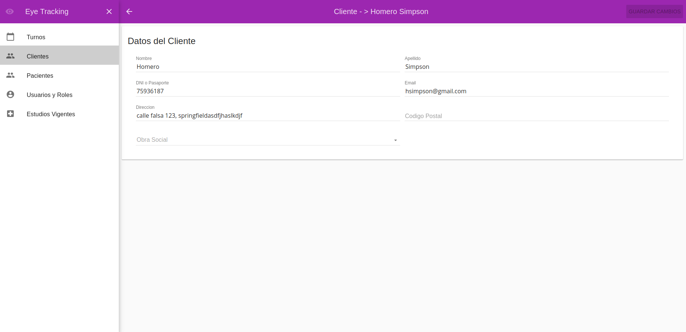

# Eye-tracking


## About
Angular 1.x web app to manage a ophthalmologist clinic
## Features
* CRUD of Users
* CRUD of Patients
* CRUD of Clients
* CRUD of Clinic history
* CRUD of Appointments
* Form validation
* Responsive design
* Feedback for users

## Tools involved
* Angular 1.x
* Angular Material
* Yeoman generator
* Moment
* Lodash
* Grunt
* Bower

##Instructions to run
it is necessary to have the [backend app](https://github.com/azorzini/eye-tracking-back) application running

```
npm install

cd src

bower install

cd ..

grunt serve
```

##More images

Login


No appointments


Appointments and date picker


Appoint new


Client info



Client list


Clinic history tabs


Client new


User new


